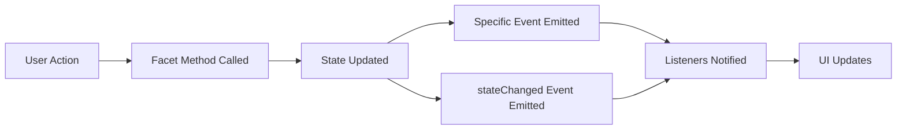

# Mycelia Facet Events Reference

This document lists all events emitted by each facet in the Ligneous application.

## Event Naming Convention

All events follow the pattern: `{facetName}:{eventType}[:{detail}]`

- **facetName**: The facet emitting the event (e.g., `gedcomFiles`, `gedcomIndividuals`)
- **eventType**: The type of event (e.g., `loaded`, `uploaded`, `error`, `stateChanged`)
- **detail**: Optional specific detail (e.g., `file:uploaded`, `individual:loaded`)

---

## Authentication Facet (`auth`)

### Events

#### `auth:registered`
**Triggered when:** A new user successfully registers
**Payload:**
```javascript
{
  type: 'auth:registered',
  body: {
    user: { id, username, email, ... }
  }
}
```

#### `auth:loggedIn`
**Triggered when:** A user successfully logs in
**Payload:**
```javascript
{
  type: 'auth:loggedIn',
  body: {
    user: { id, username, email, ... },
    token: 'jwt-token-string'
  }
}
```

#### `auth:loggedOut`
**Triggered when:** A user successfully logs out
**Payload:**
```javascript
{
  type: 'auth:loggedOut',
  body: {}
}
```

#### `auth:userLoaded`
**Triggered when:** Current user data is loaded/refreshed
**Payload:**
```javascript
{
  type: 'auth:userLoaded',
  body: {
    user: { id, username, email, ... }
  }
}
```

#### `auth:stateChanged`
**Triggered when:** Authentication state changes (loading, user, error, etc.)
**Payload:**
```javascript
{
  type: 'auth:stateChanged',
  body: {
    user: { ... } | null,
    token: 'token-string' | null,
    isAuthenticated: boolean,
    loading: boolean,
    error: string | null
  }
}
```

#### `auth:error`
**Triggered when:** An authentication operation fails
**Payload:**
```javascript
{
  type: 'auth:error',
  body: {
    error: 'error message',
    action: 'login' | 'register' | 'logout' | 'getCurrentUser'
  }
}
```

---

## GEDCOM Files Facet (`gedcomFiles`)

### Events

#### `gedcomFiles:file:uploaded`
**Triggered when:** A GEDCOM file is successfully uploaded
**Payload:**
```javascript
{
  type: 'gedcomFiles:file:uploaded',
  body: {
    file: {
      file_id: 'uuid',
      name: 'string',
      size: number,
      upload_date: 'ISO date',
      // ... other file metadata
    }
  }
}
```

#### `gedcomFiles:file:validated`
**Triggered when:** A GEDCOM file validation completes
**Payload:**
```javascript
{
  type: 'gedcomFiles:file:validated',
  body: {
    fileId: 'uuid',
    result: {
      valid: boolean,
      errors: [...],
      warnings: [...],
      // ... validation details
    }
  }
}
```

#### `gedcomFiles:file:deleted`
**Triggered when:** A GEDCOM file is successfully deleted
**Payload:**
```javascript
{
  type: 'gedcomFiles:file:deleted',
  body: {
    fileId: 'uuid'
  }
}
```

#### `gedcomFiles:stateChanged`
**Triggered when:** Files facet state changes
**Payload:**
```javascript
{
  type: 'gedcomFiles:stateChanged',
  body: {
    loading: boolean,
    error: string | null,
    currentFile: object | null,
    files: array
  }
}
```

#### `gedcomFiles:error`
**Triggered when:** A file operation fails
**Payload:**
```javascript
{
  type: 'gedcomFiles:error',
  body: {
    error: 'error message',
    action: 'uploadGedcom' | 'getFileInfo' | 'listFiles' | 'validateFile' | 'deleteFile'
  }
}
```

---

## GEDCOM Individuals Facet (`gedcomIndividuals`)

### Events

#### `gedcomIndividuals:loaded`
**Triggered when:** A list of individuals is loaded
**Payload:**
```javascript
{
  type: 'gedcomIndividuals:loaded',
  body: {
    count: number
  }
}
```

#### `gedcomIndividuals:individual:loaded`
**Triggered when:** A single individual is loaded
**Payload:**
```javascript
{
  type: 'gedcomIndividuals:individual:loaded',
  body: {
    xref: 'I1',
    individual: {
      xref: 'I1',
      name: { ... },
      birth: { ... },
      death: { ... },
      // ... individual data
    }
  }
}
```

#### `gedcomIndividuals:search:complete`
**Triggered when:** An individual search completes
**Payload:**
```javascript
{
  type: 'gedcomIndividuals:search:complete',
  body: {
    count: number
  }
}
```

#### `gedcomIndividuals:parents:loaded`
**Triggered when:** Parents of an individual are loaded
**Payload:**
```javascript
{
  type: 'gedcomIndividuals:parents:loaded',
  body: {
    xref: 'I1',
    count: number
  }
}
```

#### `gedcomIndividuals:children:loaded`
**Triggered when:** Children of an individual are loaded
**Payload:**
```javascript
{
  type: 'gedcomIndividuals:children:loaded',
  body: {
    xref: 'I1',
    count: number
  }
}
```

#### `gedcomIndividuals:siblings:loaded`
**Triggered when:** Siblings of an individual are loaded
**Payload:**
```javascript
{
  type: 'gedcomIndividuals:siblings:loaded',
  body: {
    xref: 'I1',
    count: number
  }
}
```

#### `gedcomIndividuals:spouses:loaded`
**Triggered when:** Spouses of an individual are loaded
**Payload:**
```javascript
{
  type: 'gedcomIndividuals:spouses:loaded',
  body: {
    xref: 'I1',
    count: number
  }
}
```

#### `gedcomIndividuals:stateChanged`
**Triggered when:** Individuals facet state changes
**Payload:**
```javascript
{
  type: 'gedcomIndividuals:stateChanged',
  body: {
    loading: boolean,
    error: string | null,
    individuals: array,
    currentIndividual: object | null,
    parents: array,
    children: array,
    siblings: array,
    spouses: array,
    searchResults: array
  }
}
```

#### `gedcomIndividuals:error`
**Triggered when:** An individual operation fails
**Payload:**
```javascript
{
  type: 'gedcomIndividuals:error',
  body: {
    error: 'error message',
    action: 'getIndividuals' | 'getIndividual' | 'searchIndividuals' | 'getParents' | 'getChildren' | 'getSiblings' | 'getSpouses'
  }
}
```

---

## GEDCOM Families Facet (`gedcomFamilies`)

### Events

#### `gedcomFamilies:loaded`
**Triggered when:** A list of families is loaded
**Payload:**
```javascript
{
  type: 'gedcomFamilies:loaded',
  body: {
    count: number
  }
}
```

#### `gedcomFamilies:family:loaded`
**Triggered when:** A single family is loaded
**Payload:**
```javascript
{
  type: 'gedcomFamilies:family:loaded',
  body: {
    xref: 'F1',
    family: {
      xref: 'F1',
      husband: { ... },
      wife: { ... },
      children: [...],
      // ... family data
    }
  }
}
```

#### `gedcomFamilies:stateChanged`
**Triggered when:** Families facet state changes
**Payload:**
```javascript
{
  type: 'gedcomFamilies:stateChanged',
  body: {
    loading: boolean,
    error: string | null,
    families: array,
    currentFamily: object | null
  }
}
```

#### `gedcomFamilies:error`
**Triggered when:** A family operation fails
**Payload:**
```javascript
{
  type: 'gedcomFamilies:error',
  body: {
    error: 'error message',
    action: 'getFamilies' | 'getFamily'
  }
}
```

---

## GEDCOM Graph Facet (`gedcomGraph`)

### Events

#### `gedcomGraph:relationship:calculated`
**Triggered when:** A relationship between two individuals is calculated
**Payload:**
```javascript
{
  type: 'gedcomGraph:relationship:calculated',
  body: {
    xref1: 'I1',
    xref2: 'I2',
    relationship: {
      relationship: 'string description',
      degree: number,
      // ... relationship data
    }
  }
}
```

#### `gedcomGraph:paths:found`
**Triggered when:** Paths between two individuals are found
**Payload:**
```javascript
{
  type: 'gedcomGraph:paths:found',
  body: {
    xref1: 'I1',
    xref2: 'I2',
    count: number
  }
}
```

#### `gedcomGraph:ancestors:loaded`
**Triggered when:** Ancestors of an individual are loaded
**Payload:**
```javascript
{
  type: 'gedcomGraph:ancestors:loaded',
  body: {
    xref: 'I1',
    maxGenerations: number,
    count: number
  }
}
```

#### `gedcomGraph:descendants:loaded`
**Triggered when:** Descendants of an individual are loaded
**Payload:**
```javascript
{
  type: 'gedcomGraph:descendants:loaded',
  body: {
    xref: 'I1',
    maxGenerations: number,
    count: number
  }
}
```

#### `gedcomGraph:metrics:calculated`
**Triggered when:** Graph metrics are calculated
**Payload:**
```javascript
{
  type: 'gedcomGraph:metrics:calculated',
  body: {
    metrics: {
      diameter: number,
      density: number,
      avgPathLength: number,
      // ... graph metrics
    }
  }
}
```

#### `gedcomGraph:centrality:calculated`
**Triggered when:** Centrality measures are calculated
**Payload:**
```javascript
{
  type: 'gedcomGraph:centrality:calculated',
  body: {
    type: 'degree' | 'betweenness' | 'closeness',
    count: number
  }
}
```

#### `gedcomGraph:mostConnected:loaded`
**Triggered when:** Most connected individuals are loaded
**Payload:**
```javascript
{
  type: 'gedcomGraph:mostConnected:loaded',
  body: {
    limit: number,
    type: 'degree' | 'betweenness' | 'closeness',
    count: number
  }
}
```

#### `gedcomGraph:stateChanged`
**Triggered when:** Graph facet state changes
**Payload:**
```javascript
{
  type: 'gedcomGraph:stateChanged',
  body: {
    loading: boolean,
    error: string | null,
    relationship: object | null,
    ancestors: array,
    descendants: array,
    paths: array,
    metrics: object | null,
    centrality: array,
    mostConnected: array
  }
}
```

#### `gedcomGraph:error`
**Triggered when:** A graph operation fails
**Payload:**
```javascript
{
  type: 'gedcomGraph:error',
  body: {
    error: 'error message',
    action: 'getRelationship' | 'getPaths' | 'getAncestors' | 'getDescendants' | 'getMetrics' | 'getCentrality' | 'getMostConnected'
  }
}
```

---

## GEDCOM Duplicates Facet (`gedcomDuplicates`)

### Events

#### `gedcomDuplicates:found`
**Triggered when:** Duplicates are found within a file
**Payload:**
```javascript
{
  type: 'gedcomDuplicates:found',
  body: {
    fileId: 'uuid',
    threshold: number,
    count: number
  }
}
```

#### `gedcomDuplicates:comparison:complete`
**Triggered when:** File comparison for duplicates completes
**Payload:**
```javascript
{
  type: 'gedcomDuplicates:comparison:complete',
  body: {
    fileId1: 'uuid',
    fileId2: 'uuid',
    threshold: number,
    matches: {
      // ... comparison results
    }
  }
}
```

#### `gedcomDuplicates:stateChanged`
**Triggered when:** Duplicates facet state changes
**Payload:**
```javascript
{
  type: 'gedcomDuplicates:stateChanged',
  body: {
    loading: boolean,
    error: string | null,
    duplicates: array,
    comparisonResults: object | null
  }
}
```

#### `gedcomDuplicates:error`
**Triggered when:** A duplicate detection operation fails
**Payload:**
```javascript
{
  type: 'gedcomDuplicates:error',
  body: {
    error: 'error message',
    action: 'findDuplicates' | 'compareFiles'
  }
}
```

---

## GEDCOM Places Facet (`gedcomPlaces`)

### Events

#### `gedcomPlaces:loaded`
**Triggered when:** A list of places is loaded
**Payload:**
```javascript
{
  type: 'gedcomPlaces:loaded',
  body: {
    fileId: 'uuid',
    count: number
  }
}
```

#### `gedcomPlaces:stateChanged`
**Triggered when:** Places facet state changes
**Payload:**
```javascript
{
  type: 'gedcomPlaces:stateChanged',
  body: {
    loading: boolean,
    error: string | null,
    places: array,
    currentPlace: object | null,
    totalCount: number
  }
}
```

#### `gedcomPlaces:error`
**Triggered when:** A place operation fails
**Payload:**
```javascript
{
  type: 'gedcomPlaces:error',
  body: {
    error: 'error message',
    action: 'listPlaces' | 'getPlace' | 'getPlaceEvents'
  }
}
```

---

## GEDCOM Dates Facet (`gedcomDates`)

### Events

#### `gedcomDates:loaded`
**Triggered when:** A list of dates is loaded
**Payload:**
```javascript
{
  type: 'gedcomDates:loaded',
  body: {
    fileId: 'uuid',
    count: number
  }
}
```

#### `gedcomDates:stateChanged`
**Triggered when:** Dates facet state changes
**Payload:**
```javascript
{
  type: 'gedcomDates:stateChanged',
  body: {
    loading: boolean,
    error: string | null,
    dates: array,
    currentDate: object | null,
    totalCount: number
  }
}
```

#### `gedcomDates:error`
**Triggered when:** A date operation fails
**Payload:**
```javascript
{
  type: 'gedcomDates:error',
  body: {
    error: 'error message',
    action: 'listDates' | 'getDate' | 'getDateEvents' | 'getDatesByYearRange'
  }
}
```

---

## GEDCOM Events Facet (`gedcomEvents`)

### Events

#### `gedcomEvents:loaded`
**Triggered when:** A list of events is loaded
**Payload:**
```javascript
{
  type: 'gedcomEvents:loaded',
  body: {
    fileId: 'uuid',
    count: number
  }
}
```

#### `gedcomEvents:stateChanged`
**Triggered when:** Events facet state changes
**Payload:**
```javascript
{
  type: 'gedcomEvents:stateChanged',
  body: {
    loading: boolean,
    error: string | null,
    events: array,
    currentEvent: object | null,
    totalCount: number
  }
}
```

#### `gedcomEvents:error`
**Triggered when:** An event operation fails
**Payload:**
```javascript
{
  type: 'gedcomEvents:error',
  body: {
    error: 'error message',
    action: 'listEvents' | 'getEvent' | 'getEventsByType' | 'getIndividualEvents' | 'getFamilyEvents' | 'getTimeline'
  }
}
```

---

## GEDCOM Notes Facet (`gedcomNotes`)

### Events

#### `gedcomNotes:loaded`
**Triggered when:** A list of notes is loaded
**Payload:**
```javascript
{
  type: 'gedcomNotes:loaded',
  body: {
    fileId: 'uuid',
    count: number
  }
}
```

#### `gedcomNotes:stateChanged`
**Triggered when:** Notes facet state changes
**Payload:**
```javascript
{
  type: 'gedcomNotes:stateChanged',
  body: {
    loading: boolean,
    error: string | null,
    notes: array,
    currentNote: object | null,
    totalCount: number
  }
}
```

#### `gedcomNotes:error`
**Triggered when:** A note operation fails
**Payload:**
```javascript
{
  type: 'gedcomNotes:error',
  body: {
    error: 'error message',
    action: 'listNotes' | 'getNote' | 'getTopLevelNotes' | 'getInlineNotes' | 'searchNotes'
  }
}
```

---

## GEDCOM Sources Facet (`gedcomSources`)

### Events

#### `gedcomSources:loaded`
**Triggered when:** A list of sources is loaded
**Payload:**
```javascript
{
  type: 'gedcomSources:loaded',
  body: {
    fileId: 'uuid',
    count: number
  }
}
```

#### `gedcomSources:stateChanged`
**Triggered when:** Sources facet state changes
**Payload:**
```javascript
{
  type: 'gedcomSources:stateChanged',
  body: {
    loading: boolean,
    error: string | null,
    sources: array,
    currentSource: object | null,
    totalCount: number
  }
}
```

#### `gedcomSources:error`
**Triggered when:** A source operation fails
**Payload:**
```javascript
{
  type: 'gedcomSources:error',
  body: {
    error: 'error message',
    action: 'listSources' | 'getSource' | 'getSourceCitations' | 'searchSources'
  }
}
```

---

## Using Events in Components

### With `useListener` Hook
```javascript
import { useListener } from 'mycelia-kernel-plugin/react';

function MyComponent() {
  useListener('gedcomFiles:file:uploaded', (event) => {
    console.log('File uploaded:', event.body.file);
  });

  useListener('gedcomIndividuals:loaded', (event) => {
    console.log(`Loaded ${event.body.count} individuals`);
  });

  return <div>...</div>;
}
```

### With Facet Direct Access
```javascript
import { useFacet } from 'mycelia-kernel-plugin/react';

function MyComponent() {
  const system = useFacet('system'); // Get system instance
  const listeners = system.find('listeners');

  useEffect(() => {
    const unsubscribe = listeners.on('gedcomFiles:file:uploaded', (event) => {
      console.log('File uploaded:', event.body.file);
    });

    return () => unsubscribe();
  }, [listeners]);

  return <div>...</div>;
}
```

---

## Event Best Practices

1. **Listen to specific events** rather than polling state
2. **Unsubscribe** from events when components unmount
3. **Use error events** to display user-friendly error messages
4. **Use stateChanged events** for reactive UI updates
5. **Handle events asynchronously** when needed
6. **Don't emit events manually** - let facets handle it
7. **Check event.type** if listening to multiple events

---

## Event Lifecycle



---

**Last Updated:** February 2, 2026
**Version:** 1.1.0

